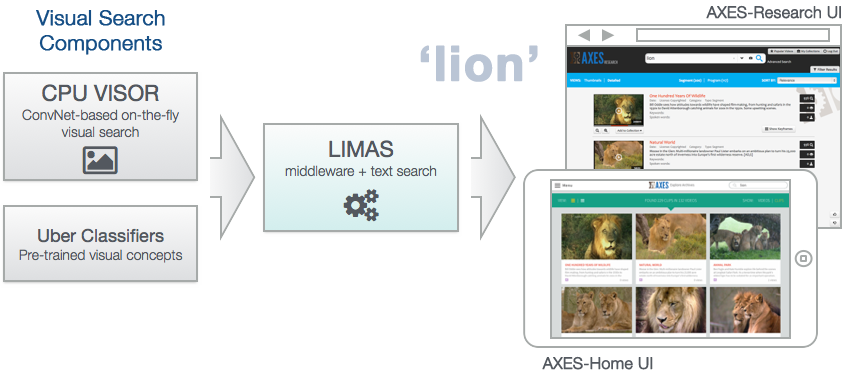

AXES-LITE
=========

Authors:

 + Ken Chatfield, University of Oxford - <ken@robots.ox.ac.uk>
 + Kevin McGuinness, Dublin City University - <kevin.mcguinness@eeng.dcu.ie>
 + Robin Aly, University of Twente - <r.aly@utwente.nl>

Copyright 2015, all rights reserved.

Release: v0.1 (April 2015)

Overview
--------

AXES-LITE provides a working example of how to link together several
visual and multimedia search services developed as part of the
[AXES project](http://www.axes-project.eu) using the LIMAS middleware
and AXES-Home/AXES-Research web frontend to provide a fully-working
multimedia retrieval system over any dataset of video data.

Currently the following core components are supported:

 - `cpuvisor-srv` - On-the-fly visual category search from the University of Oxford
 - `uberclassifiers` - Uberclassifiers from KU Leuven

Dependencies
------------

In order to run the web frontend and middleware, the following dependencies
are required:

##### 1. NGINX

NGINX is a HTTP server used to serve the frontend. You can use your own
installation, or have AXES-LITE manage a local version by downloading a copy as
follows:

    $ wget http://nginx.org/download/nginx-1.7.11.tar.gz
    $ tar xvzp -f nginx-1.7.11.tar.gz
    $ rm nginx-1.7.11.tar.gz
    $ mv nginx-1.7.11 nginx
    $ cd nginx
    $ ./configure --prefix=$PWD
    $ make
    $ make install

##### 2. MongoDB

A MongoDB instance is used to store data in the middleware. Again, you can
use your own installation, or have AXES-LITE manage a local version by downloading
a copy as follows:

    $ wget <MONGO_URL>
    $ tar xvzp -f mongodb*tgz
    $ rm mongodb*tgz
    $ mv mongodb* mongodb

Where `<MONGO_URL>` is the appropriate MongoDB package URL for your operating
system, obtained on the [MongoDB website](https://www.mongodb.org/downloads).

Installing the AXES Components
------------------------------

First, the following components must be installed:

 - `cpuvisor-srv` available at: https://github.com/kencoken/cpuvisor-srv
 - `limas` available at: https://bitbucket.org/alyr/limas
 - `imsearch-tools` available at: https://github.com/kencoken/imsearch-tools

In addition, one or both of the two available web frontends is also required:

 - `axes-home` available at: https://github.com/kevinmcguinness/axes-home
 - `axes-research` available at: https://github.com/kevinmcguinness/axes-research

**TODO: Add further details about the differences between these two interfaces here**

The location of these components, along with other configuration settings
related to AXES-LITE such as the location of the target data, are set using a
configuration file `config.json` which must exist in this directory.

A template is provided to help with the preparation of this configuration file
`config.json.template`. You can specify the paths to point to your installation
of these components anywhere on the disk - in the template all components are
set to be stored in subdirectories within this directory.

Once a `config.json` has been created, for convenience a script is provided to
download all the above components automatically if you do not already have them.
It can be run as follows:

    $ python get_components.py

Once the components have been downloaded, they must be installed and configured
as normal, following the instructions in their respective `README` files.
As AXES-LITE will handle the generation of the necessary configuration files for
each component, the procedure for each component is slightly simplified. A summary
is provided in the sections which follow:

##### 1. CPUVISOR-SRV

Only the steps outlined in the *Installation Instructions* section of the README
need to be followed. After obtaining the necessary dependencies of cpuvisor-srv
itself (for which the
[following helper package](https://bitbucket.org/kencoken/cpuvisor-srv-installer)
may be useful) this is a case of simply issuing from within the cpuvisor-srv
directory:

    $ cd cpuvisor-srv
    $ mkdir build
    $ cd build
    $ cmake ../
    $ make
    $ make install

##### 2. LIMAS

For limas to run you only need to execute step 2 from the installation
procedure, as detailed in the README:

    $ cd limas
    $ mvn install

##### 3. imsearch-tools

Only the dependencies for imsearch-tools need to be installed manually. This can
be done in a Python virtual environment using the following commands:

    $ cd imsearch-tools
    $ virtualenv venv
    $ . ./venv/bin/activate
    $ pip install -r requirements.txt
    $ deactivate

##### 4. AXES-Home interface

Only the dependencies for AXES-Home need to be installed manually. This can
be done in a Python virtual environment using the following commands:

    $ cd axes-home/server
    $ virtualenv venv
    $ . ./venv/bin/activate
    $ pip install -r requirements.txt

##### 5. AXES-Research interface

Only the dependencies for AXES-Research need to be installed manually, which
can be accomplished as follows:

    $ cd axes-research
    $ cp axesresearch/settings/local.py.tmpl axesresearch/settings/local.py
    $ ./bootstrap.sh

Getting some Data
-----------------

The AXES-LITE system requires a collection of visual data which will be used
as the target dataset for its multimedia search components. This data must be
in the format specified in the *Indexing* section of the
[LIMAS README file](https://bitbucket.org/alyr/limas) and it's location is specified
in `config.json` in the *collections* section.

### Preparing the demo dataset

To experiment with the system, a small demo dataset consisting of two videos
is provided in the correct format. It can be obtained as follows:

    $ wget http://axis.ewi.utwente.nl/collections/cAXESOpen/cAXESOpenMini.tgz
    $ tar xvzp -f cAXESOpenMini.tgz
    $ rm cAXESOpenMini.tgz

This will create a `cAXESOpenMini` folder in the axes-lite directory. Please
specify this path both as private and as public data set in `config.json`.

### Running over custom data

The `cAXESOpenMini` dataset provides an example of the required format for your
own datasets. Given a set of videos, LIMAS provides a set of scripts to generate
the required metadata. However, a shot extractor must be used to generate the
keyframes required in the `keyframes/` directory of any new collection.

** TODO: Add a note about shot extraction here? **

Linking the Components Together
-------------------------------

Now that the individual system components have been downloaded and their paths
specified in `config.json`, we first link the systems together:

    $ python link_components.py

The linking step generates the component-specific configuration files. Following this,
we are reday for indexing of our target data.

First, we must ensure MongoDB is running, as it is required for LIMAS indexing. This
can be done either manually, ensuring it runs on the same port as specified in `config.json`,
or using the utility script `./start_mongo.sh` which is generated during the linking stage
(see the next section for other ways of starting MongoDB). Following this, indexing
can be initiated for a given dataset:

    $ python index_data.py

The indexing step can take some time depending on how fast your system is and
the size of the target data (specified in the *collection* section of `config.json`)
as the visual features for all keyframes must be computed. Typically, this will take
anywhere from 0.3-1 second per image.

For the sample `cAXESOpenMini` data described in the previous section, by default
precomputed features will be downloaded from the web instead to save time and
allow a demonstration system to be setup relatively quickly even on a slower system.

Note that the indexing script can be rerun again if you later change `config.json`
to specify a different target dataset, but only a single target dataset can
be specified at a time.

Starting the system
-------------------

Once the above steps have been completed, the web service can be launched.

It is recommended to do this with the
[Supervisor Process Control system](http://supervisord.org) as this offers
advanced functionality such as control over individual components and service
monitoring (see the section below on how to do so). However, for debugging
purposes and simple usage, a set of shell scripts is also provided.

First, ensure MongoDB and NGINX dependencies are up and running in two separate
shell windows. If you have installed both to the location specified in
`conf.json`, then `link_components.py` will generate two utility scripts that
will do this for you:

    $ ./start_mongo.sh
    $ ./start_nginx.sh

Following this, run the start script (which is also generated during the linking stage):

    $ ./start.sh axes-home

This will launch all components using AXES-Home as the web frontend. Replace `axes-home`
with `axes-research` to use the AXES-Research frontend instead.

The result will be a [GNU Screen instance](http://en.wikipedia.org/wiki/GNU_Screen)
within the current shell within which all configured components will be started,
which can be used to monitor the output of each of the components interactively.
Use `Ctrl+a d` to detach from the screen session and leave it running in the background.

### Accessing the web service

Once AXES-LITE has been started, the web frontend can be accessed via NGINX in your
browser at the following address:

    http://localhost:<NGINX_PORT>/<MOUNT_POINT>

Where the values of `<NGINX_PORT>` and `<MOUNT_POINT>` are specified in
`config.json` as follows:

|                                     | Key in configuration file         | Default value  |
|-------------------------------------|:----------------------------------|:---------------|
| 1.  `<NGINX_PORT>`                  | *links.nginx.server_port*         | 8080           |
| 2a. `<MOUNT_POINT>` (AXES-Home)     | *links.axes-home.mount_point*     | /axes/home     |
| 2b. `<MOUNT_POINT>` (AXES-Research) | *links.axes-research.mount_point* | /axes/research |

Using the default configuration file, this results in the following URL for AXES-Home
and AXES-Research respectively:

    http://localhost:8080/axes/home
    http://localhost:8080/axes/research

### Launching using Supervisor (recommended)

Supervisor provides a fully featured process management system which helps to
manage and control a collection of services in the background, offering advanced
functionality such as the automatic restarting of crashed processes, service
monitoring and much more.

If you do not have Supervisor already, it can be installed as follows:

    $ pip install supervisor

After completing the preparation steps in the previous section, using Supervisor
to launch AXES-LITE is also relatively straightforward, and follows a daemon
pattern similar to `init.d` and other standard unix tools.

##### Starting the system

Note: The following assumes you are running Supervisor from the axes-lite
directory. If not, add `-c /path/to/supervisord.conf` to the commands below.

Start the Supervisor demon process:

    $ supervisord

This will start the Supervisor daemon process using the `supervisord.conf` configuration
file in the current directory.

If you do not already have MongoDB and NGINX running, start them with `supervisorctl`:

    $ supervisorctl start mongodb nginx

Start all the components:

    $ supervisorctl start components:*

And start the AXES-Home interface:

    $ supervisorctl start axes-home

Or you can start the AXES-Research interface by using `axes-research` instead
of `axes-home` in the above. You can check on the status of the system
components with the using supervisor's status command:

    $ supervisorctl status

Each of the components writes log files to the `logs` subdirectory. You should
check these log files if any component fails to start.

##### Stopping the system

Run the following to shutdown Supervisor:

    $ supervisorctl shutdown

This will terminate the Supervisor daemon launched in the previous section,
and stop all running services.

##### Starting and stopping individual components

You can restart and individual component using Supervisor's restart command.
For example, to restart the AXES home user interface, run:

    $ supervisorctl restart axes-home

Components can also be stopped and started manually using the `stop` and `start`
commands.
